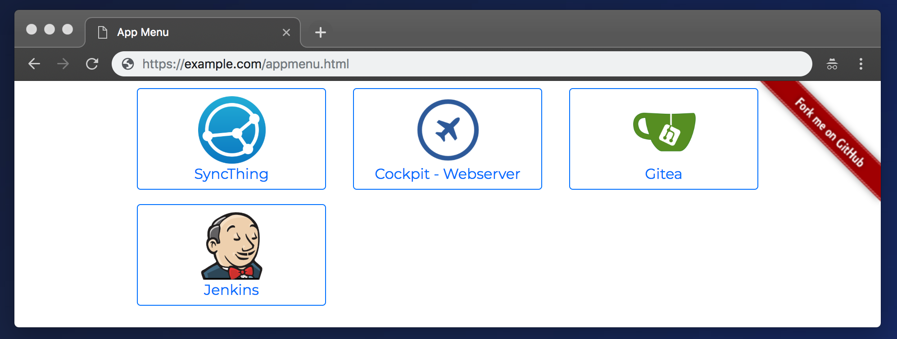

# App Menu

A no-frills static-site generator to build a menu of links to your self-hosted applications. 

...Because I frequently forget where I installed an application that I was testing.

Tested using **Ansible 2.6.4**.

This tool has no relation to any of the displayed/referenced logos or services. They were simply used as examples of commonly self-hosted services for exactly this use case.